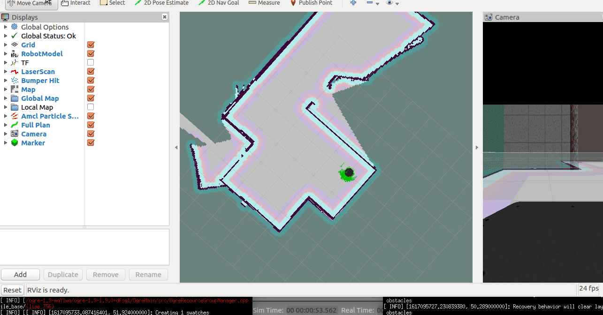

# Home Service Robot Project


## Project summary
### A brief write-up explaining the packages used for this project, covering localization, mapping and navigation.
Initially, four open source packages were downloaded as per the instructions given in the project rubric. They are
1. turtlebot
2. turtlebot_simulator
3. turtlebot_interactions
4. slam_gmapping

And then the following two packages were created, 
1. pick_objects - depends on roscpp, actionlib & move_base_msgs 
2. add_markers - depends on roscpp & visualization_msgs

The project included the following five tasks
1. test_slam.sh - This shell script runs custom world file, gmapping for gridSLAM, turtlrbot_teleop and rviz visualization nodes. On running this file, we use the teleop node to move the robot around the world and create a map. The robot has a camera and a 1D lidar on it. These sensors are used to create the 2D occupancy grid map. The map is saved using the following command. And then finally copied to the map folder in the HomeService-Udacity-Robot directory. In my world file, there was not enough objects placed in the world, which made it difficult to create a map faster. Most of the locations were getting wrongly mapped so I had to do the process many times to get the final map. In the areas like a long hallway, placing boxes as an guide can help mapping easier and keep the map accurate without any erroneous shrinking in the hallway length.

```
rosrun map_server map_server -f mymap
```

2. test_navigation.sh - This shell script runs the custom world file, rviz visualization and amcl nodes. These nodes help test the 2D nav goal feature of move_base and helps estimate the accurate location of the robot on the map which can be used in future steps for alignment. After using the 2D pose estimate feature, the following initial estimate was displayed on the terminal. 
```
initial_pose_x:=-1.057 initial_pose_y:=0.002 initial_pose_a:=-0.014
```

3. pick_objects.sh - This shell script again runs the custom world, rviz, pick_objects and amcl nodes. The amcl node launches the map and helps in planning and navigation tasks as requested by the pick_object node. The pick object node moves the robot to a pick up location. Waits for 5 seconds to simulate the pick up process and finally goes to a drop off location before getting shutdown. It uses actionlib. The path planner uses D* to generate the trajectory to reach the input locations by traversing the 2D grid. It also uses SLAM for amcl localization and 2D mapping. I have created a config folder containing locations.yaml file which contains the pick up and drop off locations. It is used by the pick_objects nodes to move the robot. Additionally, a publisher is created to send goal feedback to the add_markers to synchronize the markers display with the robot task at hand.

4. add_markers.sh - This shell script runs the gazebo world, rviz, amcl_demo and the add_markers nodes. Here the add_markers node sends a blue cube on the rviz screen at the pick up location, deletes the marker for next five seconds and finally a cube is shown on the drop off location. And the amcl_demo launches the map on the rviz screen. The add_markers node subscribes the goal feedback and shifts modes, where is either adds a cube at respective locations or deletes it as per the feedback.

5. home_service.sh - This shell script launches all the five nodes namely: rviz, custom world, pick_objects, add_markers and amcl_demo. Here a marker is displayed on the pickup location until the robot reaches that location. The marker is deleted and the robot waits for 5 seconds to simulate the pickup process. Then after the drop off location is sent to the robot, the moves again. At the drop off location, a blue marker is shown to show the drop off is completed.


## Project Rubrics
### Directory design
```
  ├──                                # Official ROS packages
    |
    ├── slam_gmapping                  # gmapping_demo.launch file
    │   ├── gmapping
    │   ├── ...
    ├── turtlebot                      # keyboard_teleop.launch file
    │   ├── turtlebot_teleop
    │   ├── ...
    ├── turtlebot_interactions         # view_navigation.launch file
    │   ├── turtlebot_rviz_launchers
    │   ├── ...
    ├── turtlebot_simulator            # turtlebot_world.launch file 
    │   ├── turtlebot_gazebo
    │   ├── ...
    ├──                                # Your packages and direcotries
    |
    ├── map                          # map files
    │   ├── ...
    ├── scripts                   # shell scripts files
    │   ├── ...
    ├──rvizConfig                      # rviz configuration files
    │   ├── ...
    ├──pick_objects                    # pick_objects C++ node
    │   ├── src/pick_objects.cpp
    │   ├── ...
    ├──add_markers                     # add_marker C++ node
    │   ├── src/add_markers.cpp
    │   ├── ...
    └──
```

### Mapping
1. Writen a test_slam.sh script file and launched it to manually test SLAM.
2. Created a functional map of the environment which would be used for localization and navigation tasks.

### Localization and Navigation
1. Robot could navigate in the environment after a 2D Nav Goal command is issued. 
2. Created a test_navigation.sh script file to launch it for manual navigation test.
3. Created a pick_objects.sh file that will send multiple goals for the robot to reach.

### Home Service Functions
1. Writen a add_marker.sh file that will publish a marker to rviz.
2. Writen a home_service.sh file that will run all the nodes in this project.

## Build Instructions
```
mkdir ~/workspace/catkin_ws
cd ~/workspace/catkin_ws
git clone --recursive https://github.com/rtkartista/HomeService-Udacity-Robot.git
cd HomeService-Udacity-Robot
catkin_init_workspace
# copy files from script files to the catkin_ws directory
catkin_make
./home_service.sh
```
